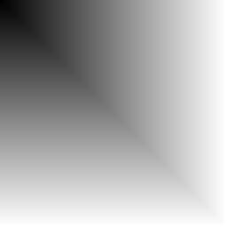
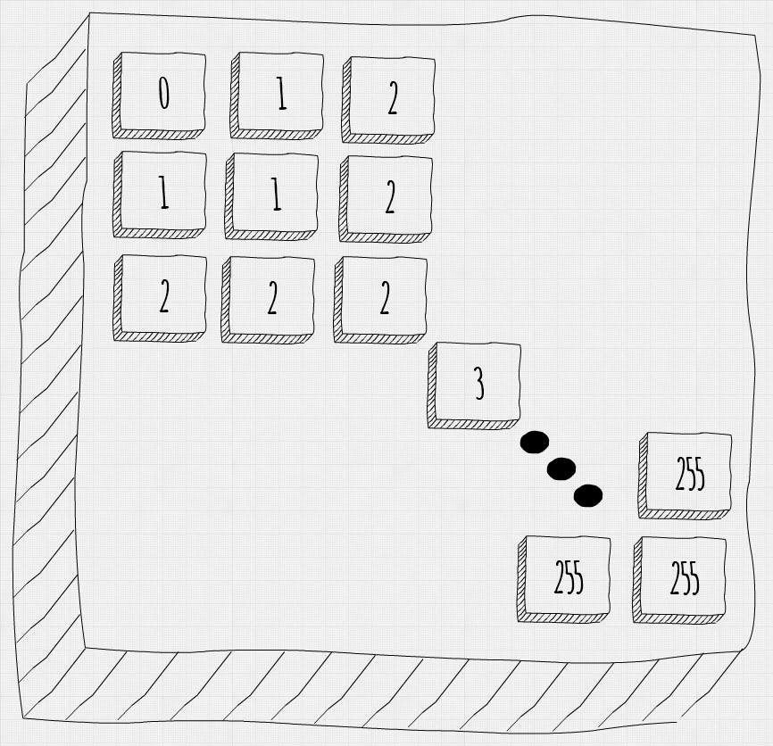

# 256 shades of gray :kick_scooter:

L'obiettivo di questo esercizio è riprodurre col vostro codice questa immagine:

In questa immagine **grande 256 * 256** sono presenti tutte le 256 sfumature di grigio riproducibili, per averne una basta settare dare ad un pixel lo stesso valore per ogni canale perciò Color pixel = new Color(127,127,127) ci darà un tipo di grigio.

Questa immagine è strutturata nel seguente modo: i pixel sulla diagonale hanno come valore di grigio il valore del loro indice (per esempio, il pixel in posizione (10,10) avrà come colore (10,10,10)), gli altri pixel nella matrice avranno come colore quello del valore più alto della loro coppia (per esempio, il pixel 120, 67 avrà come colore di pixel (120,120,120)), lo schemino qui sotto vi aiuterà a capire.

Salvate la nuova immagine in formato jpg, se ottenete un'immagine esattamente identica a quella nella repo potete considerare l'esercizio concluso :wink: