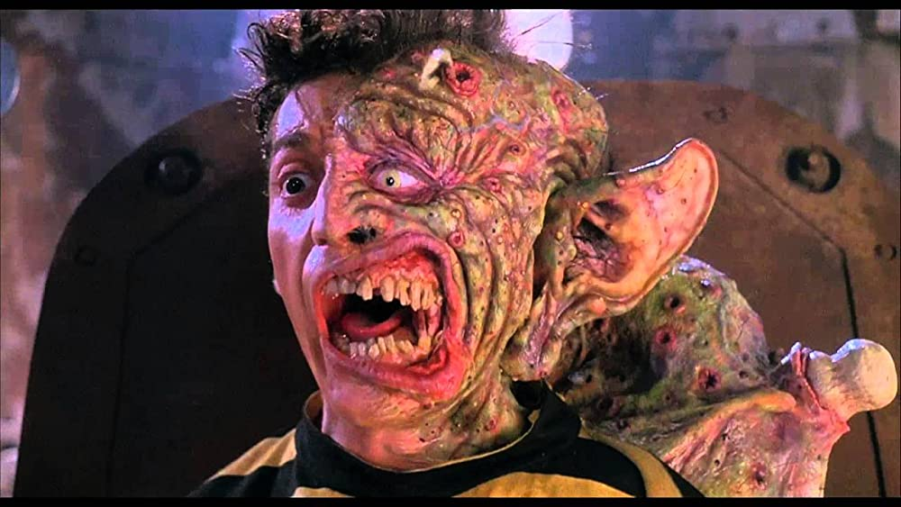
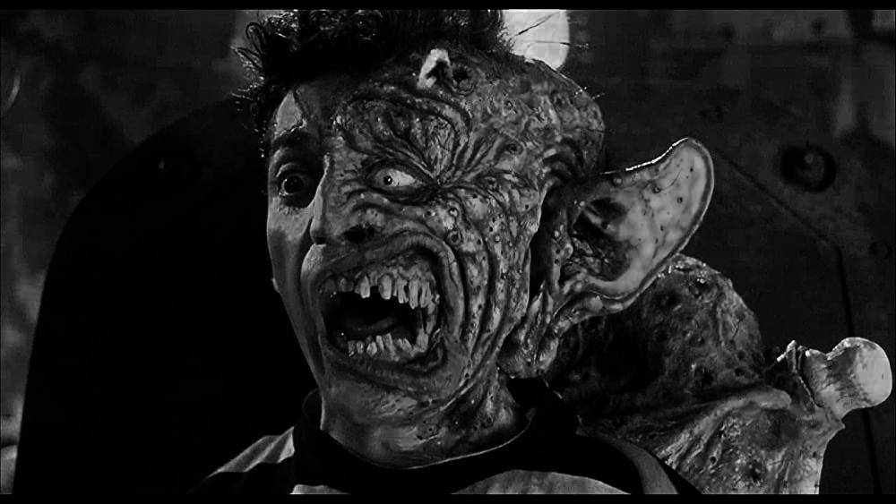
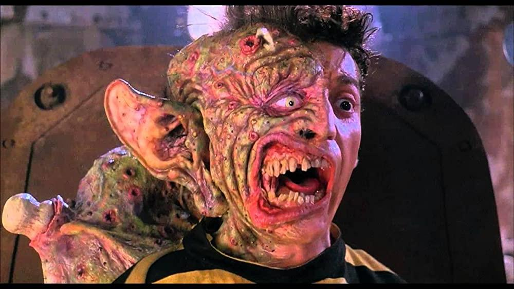
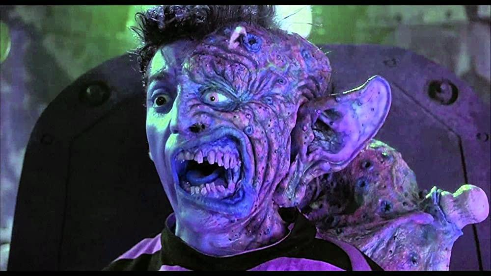
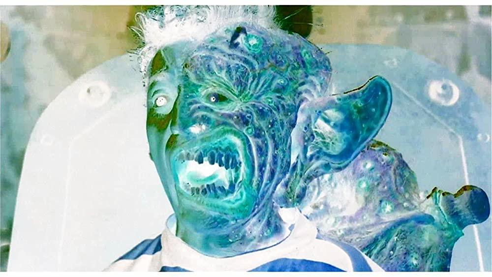
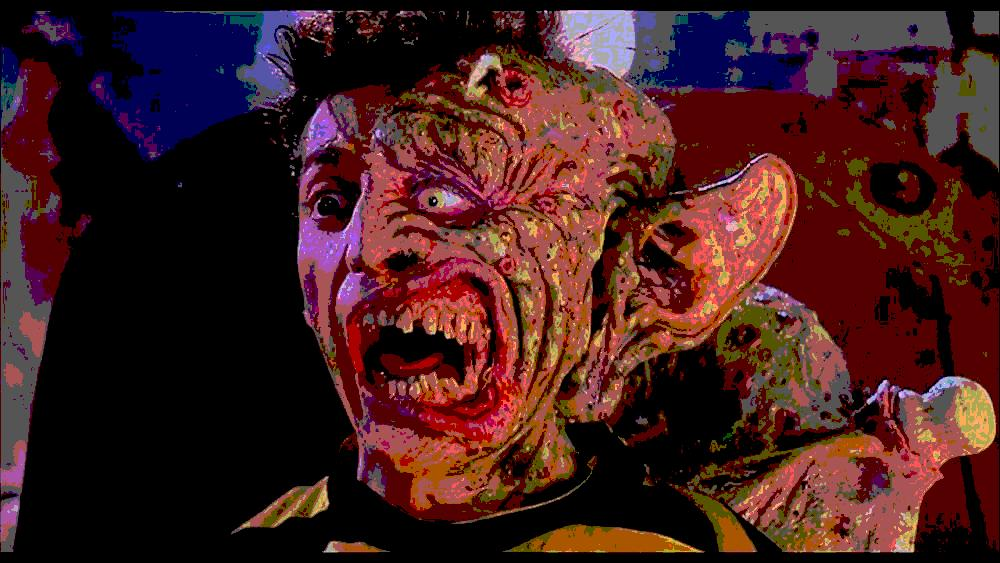

# Filtri immagini :kick_scooter:

In questo esercizio dovrete scrivere una classe che contenga 5 metodi che eseguono dei "filtri" (in maniera analoga ai filtri instagram) su un immagine letta da disco.

[*Freaked - sgorbi*](https://www.imdb.com/title/tt0109838/)

## **1. Filtro bianco e nero**

Questo filtro prende un oggetto BufferedImage in input e restituisce in output una nuova BufferedImage che rappresenta l'immagine in input in bianco e nero. Per ottenere l'effetto, dato un pixel e quindi il relativo colore bisogna fare un calcolo "pesato" e cioè:

luma = 77R + 150G + 28B

Luma è il valore di grigio che userete per il nuovo pixel.

## **2. Filtro specchio**

Questo filtro prende un oggetto BufferedImage in input e restituisce in output una nuova BufferedImage che rappresenta l'immagine specchiata rispetto a quella in input.

## **3. Filtro GBR**

Questo filtro prende un oggetto BufferedImage in input e restituisce in output una nuova BufferedImage che rappresenta l'immagine di input ma con i canali scambiati e cioè in verde, blue rosso. Cioè significa che se un pixel originariamente aveva come valori (50,100,200) il nuovo pixel avrà come valore (100, 200, 50).

## **4. Filtro negativo**

Questo filtro prende un oggetto BufferedImage in input e restituisce in output una nuova BufferedImage che rappresenta il negativo dell'immagine in output. Per ottenere il negativo, per ogni pixel dell'immagine, bisogna calcolare per canale il seguente calcolo: 255 - valore corrente.
Per esempio, se un pixel ha come valore (100, 20, 225) il suo negativo sarà (155, 235, 30)

## **5. Filtro posterize**

L'ultimo filtro il posterize non soltanto prende in input un'immagine ma anche un intero positivo N, il filtro quindi quantizza i valori dei singoli canali dei pixel in N livelli. Per esempio se diamo 2 come valore ogni pixel per ogni canale potrà avere valori che saranno 0 o 127. L'immagine di esempio è stata creata dandogli 3 come input di livelli.

## **6. Filtri bonus**
Se avete terminato l'esercizio ma volete divertirvi ancora con i filtri immagine, provate a implementarne uno che vi piace o addirittura invertarne uno voi! Questi filtri "classici" li ho trovati su [questo sito](http://www.jhlabs.com/ip/filters/index.html) dove ce ne sono moltissimi altri da cui prendere anche ispirazione.